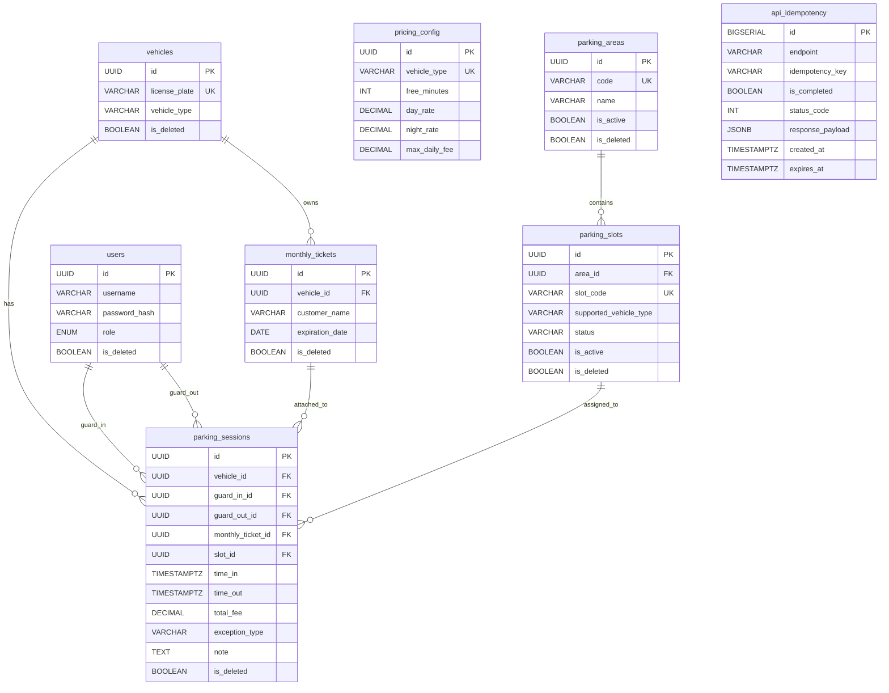
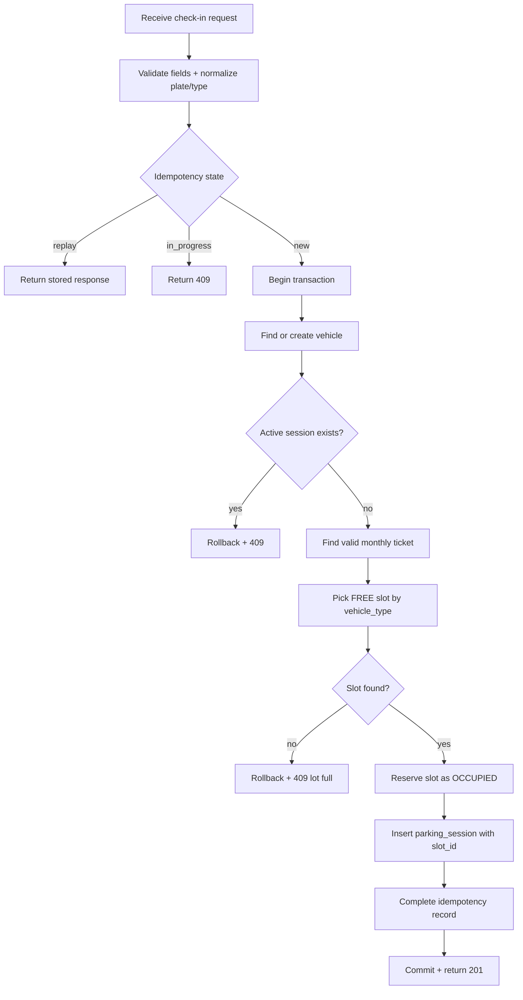
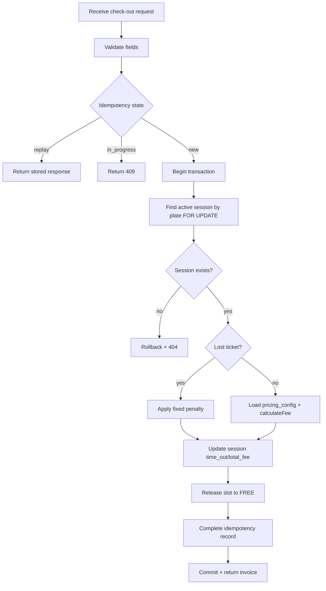
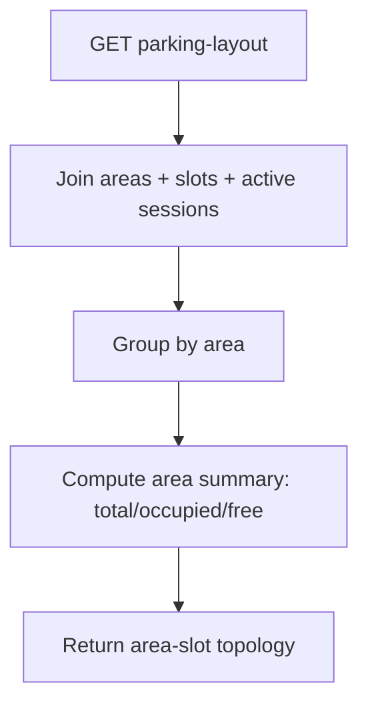
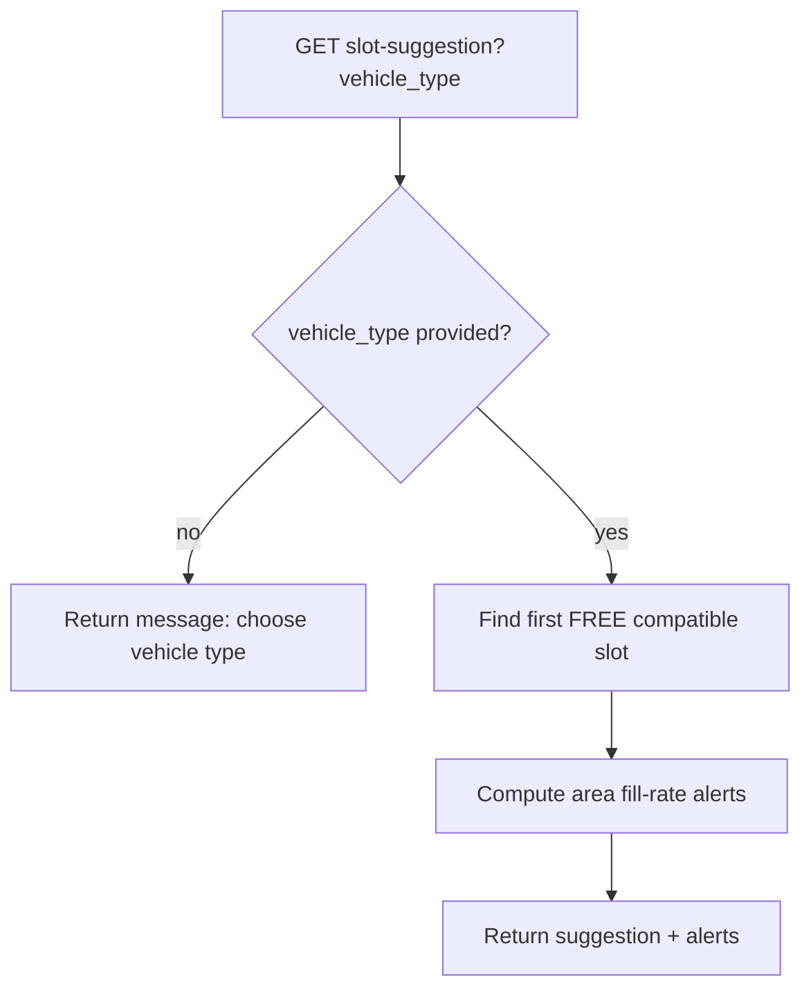

# PCS System Design Baseline

Tai lieu nay la baseline ky thuat cho PCS theo phien ban code hien tai (bao gom smart layout: area/slot).

## 1) Database ERD

### Invariants quan trong

- 1 xe chi co toi da 1 session dang mo (`time_out IS NULL`).
- `parking_slots.status` chi thuoc: `FREE`, `OCCUPIED`, `MAINTENANCE`.
- Check-in chi duoc tao session khi reserve slot thanh cong.
- Check-out phai giai phong slot (`OCCUPIED -> FREE`) trong cung transaction.
- Ghi request nhay cam co idempotency key de replay/anti-duplicate.

---

## 2) Business Flowcharts

### 2.1 Check-in

### 2.2 Check-out

### 2.3 Smart Layout / Slot Suggestion

---

## 3) API Contract Snapshot

### Core operation APIs

- `POST /api/check-in`
  - Input: `license_plate`, `vehicle_type`, `guard_in_id`
  - Header: `Idempotency-Key` (optional but recommended)
  - Success: `201`
  - Common errors: `400`, `409`

- `POST /api/check-out`
  - Input: `license_plate`, `guard_out_id`, optional `exception_type=LOST_TICKET`, `note`
  - Header: `Idempotency-Key`
  - Success: `200`
  - Common errors: `400`, `404`, `409`

- `GET /api/dashboard-summary`
  - Success: `200`
  - Output: `vehicles_in_lot`, `check_ins_today`, `check_outs_today`, `revenue_today`, `hourly_revenue`

- `GET /api/active-sessions`
  - Success: `200`
  - Output: active sessions with `license_plate`, `vehicle_type`, `time_in`, `slot_code`

### Smart layout APIs

- `GET /api/parking-layout`
  - Success: `200`
  - Output: danh sach `areas[]`, moi area co `slots[]` + `summary`

- `GET /api/slot-suggestion?vehicle_type=...`
  - Success: `200`
  - Output: `suggestion` (slot de xuat) + `alerts` (khu sap day)

### Supporting APIs

- `POST /api/auth/login`
- `POST /api/monthly-tickets`
- `GET /api/monthly-tickets/:license_plate`
- `GET /health`
- `GET /ready`

### Error matrix (quick)

- `400`: input/contract invalid
- `401/403`: auth/authorization
- `404`: resource/session not found
- `409`: business conflict, in-progress idempotent, lot/slot conflict
- `429`: rate limit
- `500`: unexpected server/database failure

---

## 4) Notes for Team

- `docs/openapi.yaml` hien chua cap nhat day du cac endpoint moi (`/api/parking-layout`, `/api/slot-suggestion`, `/api/active-sessions` co thay doi payload).  
- Nen cap nhat OpenAPI tiep theo tai lieu nay de giu contract-first nhat quan.
